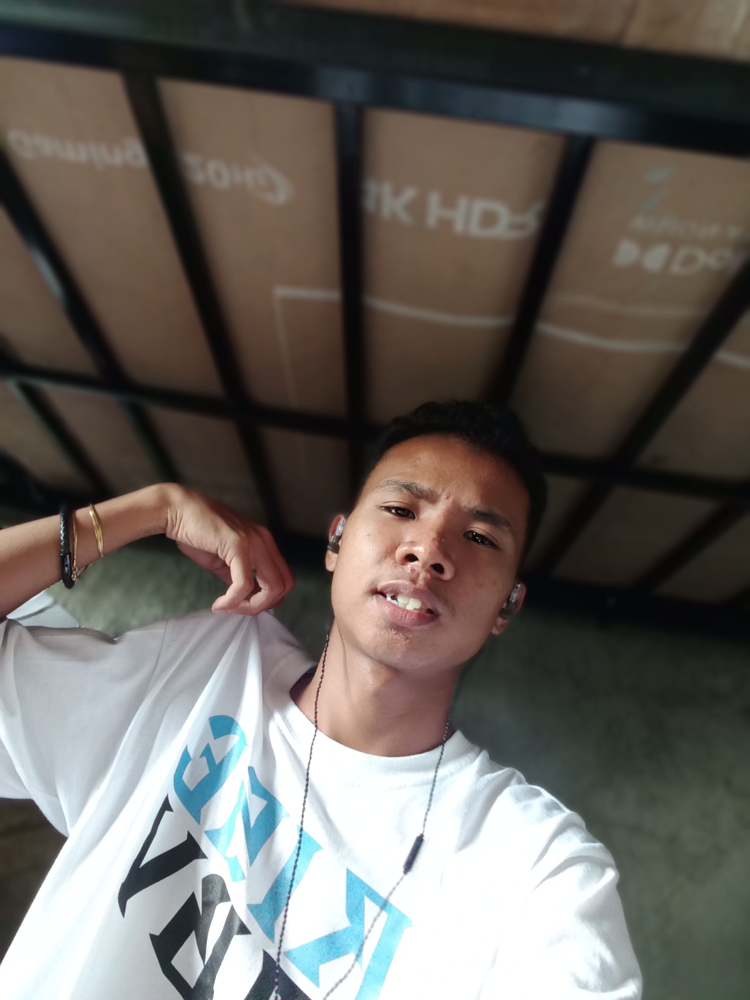
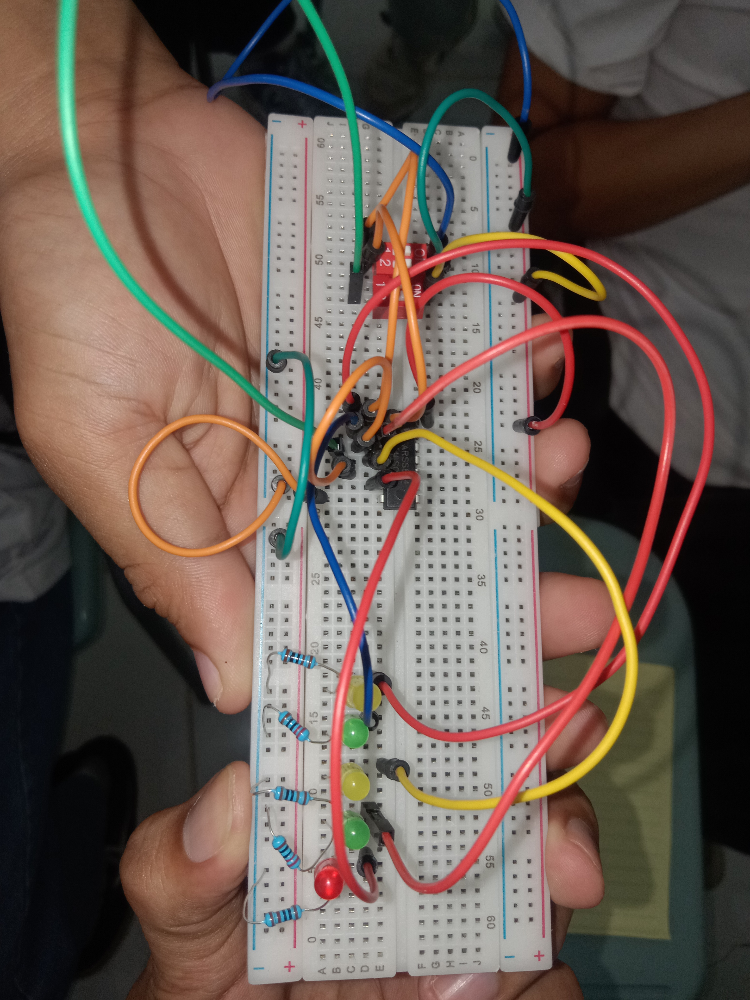
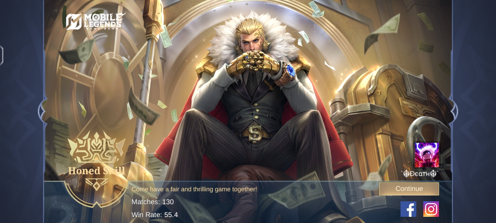

<html lang="en">
<head>
  <meta charset="utf-8" />
  <meta name="viewport" content="width=device-width, initial-scale=1" />
  <title>Ryle L. De Hitta — Portfolio</title>
  <meta name="description" content="Curious mind. Community builder. Code crafter. Portfolio of Ryle L. De Hitta, BSIT-CPT-1 student and coding enthusiast." />

  <!-- Font Awesome for icons -->
  <link rel="stylesheet" href="https://cdnjs.cloudflare.com/ajax/libs/font-awesome/6.6.0/css/all.min.css" integrity="sha512-..." crossorigin="anonymous" referrerpolicy="no-referrer" />

  
</head>
<body>
  <!-- Navigation -->
  <nav class="container" role="navigation" aria-label="Main navigation">
    
Ryle L. De Hitta

    

      <a href="#home">Home</a>
      <a href="#about">About</a>
      <a href="#projects">Projects</a>
      <a href="#skills">Skills</a>
      <a href="#contact">Contact</a>
    

    <button class="nav-toggle" id="navToggle" aria-expanded="false" aria-controls="navLinks" title="Toggle menu">
      <i class="fa-solid fa-bars" style="color:var(--muted)"></i>
    </button>
  </nav>

  <!-- HERO -->
  <main class="container" id="home" role="main">
    <section class="hero" aria-labelledby="heroTitle">
      

        <h1 id="heroTitle">Curious mind. Community builder. Code crafter.</h1>
        
Hi, I’m <strong>Ryle L. De Hitta</strong>. I build AI-powered apps, electronics demos, and community tools inspired by Filipino culture. I learn by doing and love sharing knowledge through real-world examples.

        

          <a class="btn btn-primary" href="#projects"><i class="fa-solid fa-rocket"></i> View Projects</a>
          <a class="btn btn-outline" href="#contact"><i class="fa-solid fa-paper-plane"></i> Contact</a>
        

      

      

        

          <!-- Replace below src with your profile image path -->
          
        

      

    </section>

    <!-- ABOUT -->
    <section id="about" aria-labelledby="aboutTitle">
      <h2 id="aboutTitle">About Me</h2>
      

        

          

            Hello! I’m <strong>Ryle L. De Hitta</strong>, a passionate tech explorer currently studying <strong>BSIT-CPT-1</strong>.
            My favorite habit? <strong>Coding</strong> — whether it’s building apps, experimenting with electronics, or crafting community tools that make life easier.
            I believe in learning through real-world examples, and I’m deeply inspired by Filipino culture, collaborative development, and empowering new tech.
          

          <ul style="margin-top:16px;color:var(--muted);padding-left:18px;line-height:1.8">
            <li>📚 <strong>Course:</strong> BSIT-CPT-1</li>
            <li>💻 <strong>Habit:</strong> Coding and exploring new tech</li>
            <li>📍 <strong>Location:</strong>Brgy. Mapulot,Tagkawayan,Quezon</li>
            <li>💡 <strong>Interests:</strong> AI-powered tools, electronics, Filipino literature, and community impact</li>
          </ul>
        

        <aside style="display:flex;flex-direction:column;gap:12px;align-items:center;">
          

            <h3 style="margin:0;color:#fff">Course</h3>
            
BSIT-CPT-1

          

          

            <h3 style="margin:0;color:#fff">Location</h3>
            
Brgy. Mapulot,Tagkawayan,Quezon

          

        </aside>
      

    </section>

    <!-- PROJECTS -->
    <section id="projects" aria-labelledby="projectsTitle">
      <h2 id="projectsTitle">Projects</h2>
      

        <!-- Project 1 -->
        <article class="project" aria-labelledby="p1">
          
          <h3 id="p1" style="margin:12px 0 6px">AnimeInfo</h3>
          
AI-powered anime search and community curation — React, Node.js, AI

        </article>

        <!-- Project 2 -->
        <article class="project" aria-labelledby="p2">
          
          <h3 id="p2" style="margin:12px 0 6px">Logic and Switching Theory</h3>
          
logic and switching theory-OR gates Activity

        </article>

        <!-- Project 3 -->
        <article class="project" aria-labelledby="p3">
          
          <h3 id="p3" style="margin:12px 0 6px">MLBB Highlights </h3>
          
Mobile legend bang bang Highlights-Honored Tigril

        </article>
      

    </section>

    <!-- SKILLS -->
    <section id="skills" aria-labelledby="skillsTitle">
      <h2 id="skillsTitle">Skills</h2>
      

        

          <label style="display:flex;justify-content:space-between;color:var(--muted)">JavaScript Advanced</label>
          
<i style="width:85%;"></i>

        

        

          <label style="display:flex;justify-content:space-between;color:var(--muted)">Python Intermediate</label>
          
<i style="width:70%;"></i>

        

        

          <label style="display:flex;justify-content:space-between;color:var(--muted)">Switching Theory Practical</label>
          
<i style="width:65%;"></i>

        

      

    </section>

    <!-- CONTACT -->
    <section id="contact" aria-labelledby="contactTitle">
      <h2 id="contactTitle">Contact</h2>
      
Let’s build something electrifying ⚡ — send me a message below or reach out on GitHub / LinkedIn.

      <form id="contactForm" style="margin-top:12px;max-width:720px" novalidate>
        <label>
          Name 
          <input type="text" name="name" required placeholder="Your name" />
        </label>

        <label>
          Email 
          <input type="email" name="email" required placeholder="your@email.example" />
        </label>

        <label>
          Message 
          <textarea name="message" rows="5" required placeholder="Hi Ryle, ..."></textarea>
        </label>

        

          <button type="submit">Send message</button>
          

        

      </form>
    </section>

    <!-- Footer (page) -->
    <footer class="main-footer" role="contentinfo">
      

        Connect with me:
        <!-- Update these links -->
        <a href="https://github.com/yourusername" target="_blank" rel="noopener"><i class="fa-brands fa-github"></i> GitHub</a>
        <a href="https://linkedin.com/in/yourusername" target="_blank" rel="noopener"><i class="fa-brands fa-linkedin"></i> LinkedIn</a>
        <a href="mailto:youremail@example.com"><i class="fa-solid fa-envelope"></i> Email</a>
      

      
©  Ryle L. De Hitta — Built with curiosity and code ⚡

    </footer>
  </main>

  <!-- Back to top -->
  <button id="backToTop" aria-label="Back to top">↑</button>

  <!-- Floating sticky bottom bar with icons -->
  

    <a href="https://github.com/yourusername" target="_blank" rel="noopener"><i class="fa-brands fa-github"></i> GitHub</a>
    <a href="https://linkedin.com/in/yourusername" target="_blank" rel="noopener"><i class="fa-brands fa-linkedin"></i> LinkedIn</a>
    <a href="mailto:youremail@example.com"><i class="fa-solid fa-envelope"></i> Email</a>
    <a href="#contact" title="Open contact form"><i class="fa-solid fa-comment-dots"></i> Message</a>
  

  
</body>
</html>
